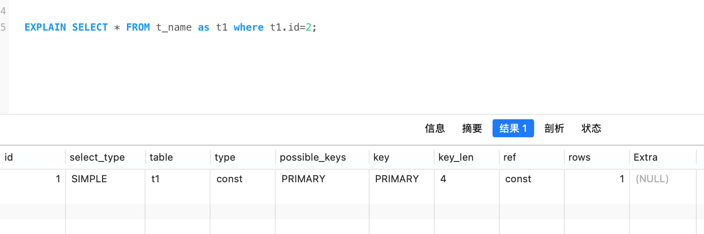
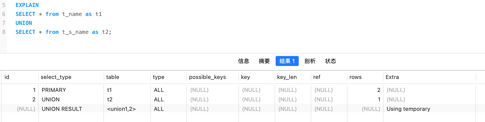
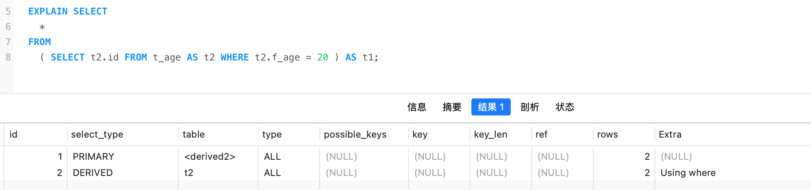
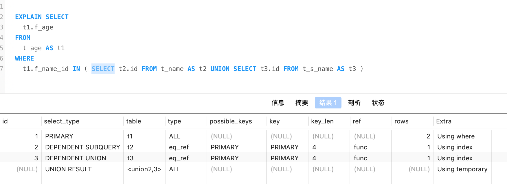
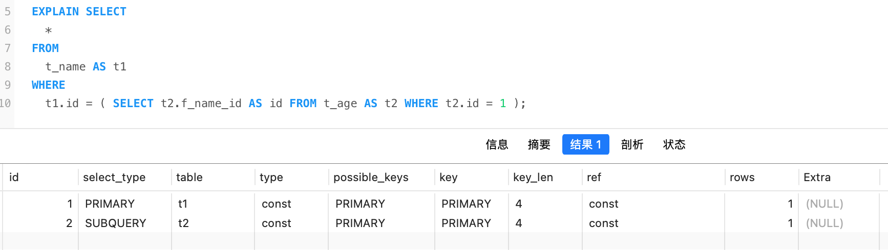
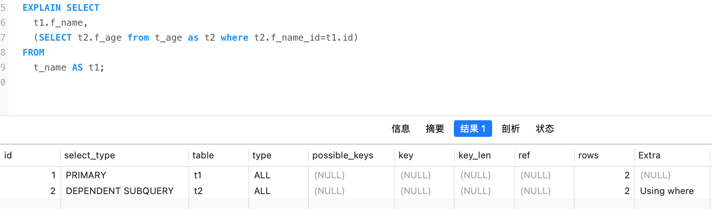
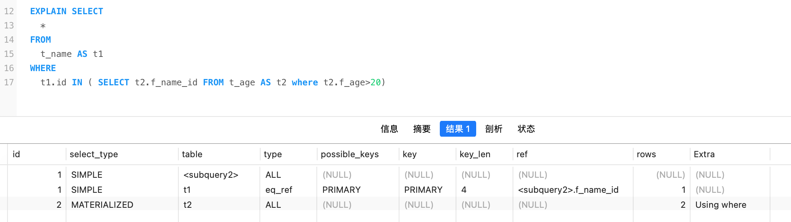

# 如何分析MySQL索引的使用情况   
在上一篇《MySQL InnoDB索引介绍》中介绍了MySQL是如何通过索引来提升查询性能的，但是我们如何知道添加的索引是否被使用？这就用到了MySQL的EXPLAIN命令。该命令提供了优化器如何处理操作请求的相关信息，包含了连接查询中表的执行顺序，以及使用了索引，给我们通过索引优化性能提供了依据，是工作中必不可少的工具。
### EXPLAIN支持的语句
EXPLAIN支持的语句包含：SELECT, DELETE, INSERT, REPLACE和UPDATE。日常工作中，更多的关注的SELECT操作性能，下面就具体看一下EXPALIAN输出的关于SELECT语句的执行计划。命令格式如下：   

`EXPLAIN SELECT statement   `

### SELECT的执行计划
EXPLAIN为SELECT语句中使用的每个表返回一行信息，并按照MySQL在处理语句时读取表的顺序进行展示。MySQL使用嵌套循环连接方法来解析所有连接操作，这意味着MySQL从第一个表中读取一行，然后依次在第二个，第三个......表中找到匹配的行，当所有表都处理完毕后，MySQL输出查询的列。   

### id
代表SELECT子句在整个查询的执行顺序，id的值为数字，越大代表越先执行，相同时，则由上到下执行。如果某行引用其他行的并集结果，则该值可以为 NULL。  

### select_type
select_type可能的值为：  

* SIMPLE：表示简单查询，没有使用union和子查询；

* PRIMARY：union或子查询的最外层的查询被标记为PRIMARY；
* DERIVED：派生表，查询过程中MySQL生成的临时表；

* UNION：union查询中第二个或之后的select查询；
* UNION RESULT: union的查询结果；

* DEPENDENT UNION：union查询中第二个或之后的select查询，依赖于外层查询；

* SUBQUERY：子查询中的select语句;

* DEPENDENT SUBQUERY：依赖外层查询的子查询；

* MATERIALIZED：物化子查询，该查询将创建一个临时表来存储查询结果

### table   
对应输出行引用的表名，可能取值如下：   

* select语句中对应的表名，例如之前例子的t1,t2等； 
* \<unionM,N\>：该行引用Id值为M和N行的并集；
* \<derived N\>：该行引用id值为N行的派生表结果。例如，派生表可能来自FROM语句中的子查询；
* \<subquery N\>：该行引用id值为N行的物化子查询的结果；

### type   
描述表的连接类型。可能取值如下：   

* system：系统表，只有1行匹配的数据，是const类型的一种特殊情况；
* const：该表只有1行匹配的数据。由于const表只需要被读取一次，所以效率非常快；
* eq\_ref：对于前面表的每个组合行，该表中都有1行与之对应；
* ref：对于前面表的每个组合行，都会从该表中读取匹配索引的所有行；
* fulltext：使用了全文索引查询；
* ref\_or\_null：在ref的基础上，需要再读取值为null的行；
* index\_merge：该连接类型表明使用了索引合并优化。 在这种情况下，输出行中的key列包含所使用的索引的列表，并且 key\_len 包含所使用的索引的最长键部分的列表。
* unique\_subquery：在一些IN类型的子查询中【如：value IN (SELECT primary_key FROM single_table WHERE some_expr)】，该类型会代替eq\_ref，因为该类型是一个index的查找方式，能够代替整个子查询提高效率；
* index_subquery：与unique\_subquery相似，区别在于用于非唯一索引的查询【例如：value IN (SELECT key_column FROM single_table WHERE some_expr)】；
* range：用于通过索引来查询符合范围查询（ =, <>, >, >=, <, <=, IS NULL, <=>, BETWEEN, LIKE, 或者 IN() ）的行，其中key列对应的是使用到索引，key_len是使用key的最长key的长度；
* index：与下面的ALL类似，只需要在索引树上的搜索，分两种情况：   

	1.  所需要查询的列包含再索引里面，此时只需要搜索索引树就可以，此时Extra中会显示 Using index；
	2. 通过索引对应主键ID，再要从表中获取数据，此时Uses index不会出现在Extra中。

* ALL：对于前面的表的每个组合行，都是通过全表扫描进行匹配。

### possible\_keys
该列给出从该表中查询时可能用到的索引，当为null时，说明没有可用的索引。   
### key
该列为MySQL决定最终要使用的索引。可能是possible\_keys里面提供的候选索引；当possible\_keys没有合适的索引时，如果只需要通过扫描索引树就可以获取要查找的值，也可能通过index cover技术来查询满足条件的索引树。如果为null值，则没有使用索引。
### key\_len
该列代表使用索引的长度【字节数】，如果索引包含的允许为NULL，则长度比不允许为NULL多1个字节【如tinyint，不允许为空时是1个字节，允许为空时是1+1=2个字节】；当没有使用索引时，该值为NULL。   
特别注意：datetime在MySQL之前5.6.4是8个字节，在之后是5个固定字节+3个可变字节(fractional seconds storage)   
### ref
该列展示了表中的哪些列或者常量与使用的索引进行匹配来查找数据。
### rows   
反馈了MySQL为查找结果需要搜索的行数。对于Innodb来说，这是个预估值。   
### Extra   
该列包含了MySQL为了解决查询请求所采用技术方案的其他信息。可能的取值有：    

* Using where：使用where条件来查询表的数据行；
* Using index：仅使用索引树来检索所需要的列信息，而无需执行额外的查找来读取实际行数据。 
* Using temporary：创建临时表来保存结果；
* Using filesort：对检索到的所有行按照sort指定的规则进行排序；
* Using index condition：使用ICP（Index Condition Pushdown）技术尽量减少读取整行数据，只使用索引包含的列信息，以减少对磁盘的I/O次数。