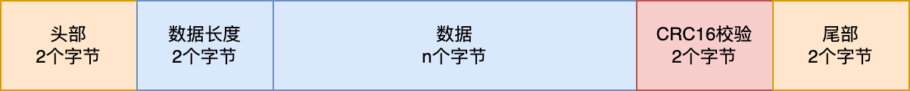
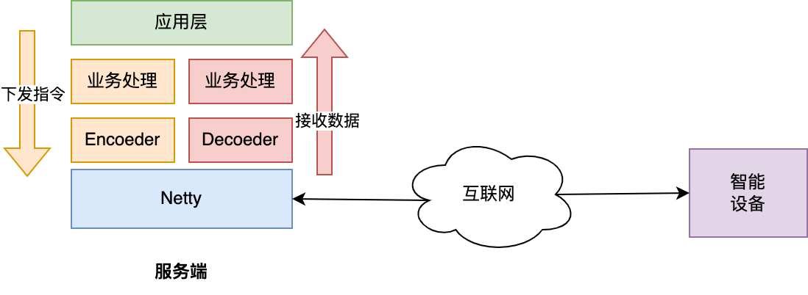

# <center>Netty在物联网中的应用(一)</center>
## 简介
物联网是指通过互联网将各种智能设备连接起来形成一个庞大的网络。现在各种智能家居应用也越来月广泛，有的需要远程控制，有的只是采集数据。  
有需要远程控制的场景，我们一般会选择TCP/IP网络协议，让设备和服务端保持长连接通信，以保证指令能够及时下发到智能设备上。  
Netty作为一种高性能，异步事件驱动的网络应用程序框架，提供了更好的可扩展性和效率，支持多种传输协议，如TCP、UDP、HTTP、WebSocket等，还提供了许多可扩展的组件和工具，如管道处理器、编解码器、事件处理机制、ByteBuf、异步IO、高并发等，方便开发人员构建可维护、可扩展、高性能的网络应用程序，广泛应用于网络游戏、实时聊天、金融和电信等领域。  
为了解决智能设备与服务端通信的问题，还要使得通信两端达成数据契约（即通讯协议），保证两端可以用同样的方式理解和处理数据。    
## 通讯协议
智能设备的计算和存储能力一般都有限，所以，制定用于传输数据的通讯协议时要尽量选用紧凑和高效的格式，保证通信的效率和减少通信的开销。项目中常用的是二进制通讯格式，如下图是协议的主要结构：  

*注：协议的字段长度可以根据自己的实际需求调整*  

**头部**：用于标识一个条指令的开始标志，例如：0x65 0x56；  
**数据长度**：用于标识数据部分的长度；  
**数据**：用于设备和服务端之间传递的数据，其长度范围为数据长度的所有能标识的范围，如2个字节的范围为0-65535；  
**CRC16校验**：对数据的完整性进行校验，校验范围包含数据长度和数据内容。  
**尾部**：标识一条指令的结束标志，例如：0x57 0x75。  

**一条指令的总长度为**：  
头部长度(2个字节)+数据长度(2个字节)+数据(n个字节)+CRC16(2个字节)+尾部(2个字节)  

**心跳指令**：  
心跳是一种特殊的指令，其定时向服务端发送“心跳”数据，主要用于维持设备与服务端间的连接，并告知服务器其在线状态。心跳指令可以是一条单纯的连接保活指令。也可以把定时上报设备采集数据的指令兼用为一种心跳指令。  
## 服务端架构
  
如上图，是一个简单服务端的架构图，其主要完成以下功能：  
1. 监听智能设备的TCP连接请求，并完成TCP连接建立；  
2. 接收来自设备上报的数据，进行解码处理，并交给业务成处理；  
3.将业务指令进行编码下发到设备；

### 基于Netty的Server端实现  
```
 EventLoopGroup bossGroup = new NioEventLoopGroup();  
 EventLoopGroup workerGroup = new NioEventLoopGroup();  
 try {  
      ServerBootstrap bootstrap = new ServerBootstrap();
      bootstrap.group(bossGroup, workerGroup)  
               .channel(NioServerSocketChannel.class)  
               .childHandler(new ChannelInitializer<SocketChannel>() {  
                    @Override  
                    protected void initChannel(SocketChannel socketChannel) throws Exception {  
                     socketChannel.pipeline()  
                                  .addLast(new Decoder())  
                                  .addLast(new ServerHandler());  
                        }  
                    })  
                    .option(ChannelOption.SO_BACKLOG, 128)  
                    .childOption(ChannelOption.SO_KEEPALIVE, true);  
        ChannelFuture future = bootstrap.bind(30011).sync();  
     } catch (InterruptedException e) {  
            e.printStackTrace();  
     }  
```

### 基于Netty的Client端实现

```
 EventLoopGroup workerGroup = new NioEventLoopGroup();

 Bootstrap bootstrap = new Bootstrap();
 bootstrap.group(workerGroup);
 bootstrap.channel(NioSocketChannel.class);
 bootstrap.option(ChannelOption.SO_KEEPALIVE, true);
 bootstrap.handler(new ChannelInitializer<SocketChannel>() {
 @Override
 protected void initChannel(SocketChannel ch) throws Exception {
      ch.pipeline().addLast(new Encoder());
    }
 });
 ChannelFuture future = bootstrap.connect(host, port).sync();
 channel = future.channel();
```


