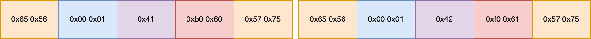
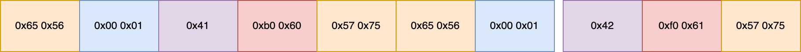

# <center>Netty在物联网中的应用(二)</center>
## 粘包/拆包问题   
TCP/IP是基于流的传输协议，在传输中，需要将接收到的数据存储在套接字接收缓冲区中。但基于流的传输缓冲区不是数据包队列，而是字节队列。 这意味着，即使您将两条消息作为两个独立的数据包发送，操作系统也不会将它们视为两条消息，而只是将其视为一堆字节。 因此，无法保证应用层所读的内容正是远程对等方所写的内容。 例如，假设操作系统的 TCP/IP 堆栈已收到两个数据包：   
 
    
 
 基于流的协议特点，在应用程序中很可能以下的碎片形式读取这两个数据包，其中第一个片段由第一个数据包和第二个数据包的一部分组成【相当于两个数据包粘到一起，即常说的粘包问题】，而第二数据片段则只包含了第二个数据包的剩余部分【也就是拆包问题，即第二个数据包被拆分成两个部分】。   
    
 
##  解决方案
为了能够使得应用程序能够正常的处理数据，我们需要把接受到数据片段整理成一个个符合规定的完成数据包。为此，我们需要基于Netty的ByteToMessageDecoder类对数据片段进行处理：   
1. 每当接收到新数据时，ByteToMessageDecoder 都会使用内部维护的累积缓冲区调用decode() 方法。
2. 在decode()方法中，我们可以按照规则组装成一个完整的数据包然后加入到out队列中，代表着解码器成功解析出一个完整的消息，用于后续的ChannelInboundHandler进行处理。  
3. ByteToMessageDecoder 将丢弃累积缓冲区的读取部分，并且不需要不需要解码多条消息，ByteToMessageDecoder将继续调用decode()方法，直到它没有添加任何内容。  
### 基于ByteToMessageDecoder的解码器
``` 
public class Decoder extends ByteToMessageDecoder {

    @Override
    protected void decode(ChannelHandlerContext ctx, ByteBuf in, List<Object> out) throws Exception {

        if (in.readableBytes() <= MessageFrameStructs.FRAME_HEAD_LENGTH + MessageFrameStructs.FRAME_DATA_LENGTH) {
            in.retain();
            return;
        }

        byte[] heads = new byte[MessageFrameStructs.FRAME_HEAD_LENGTH];
        in.getBytes(0, heads);

        //头部头部不正确，直接丢弃数据报文
        if (!isHead(heads)) {
            in.clear();
            return;
        }

        //获取数据长度
        int dataLength = in.getUnsignedShort(MessageFrameStructs.FRAME_HEAD_LENGTH);

        //数据长度不够
        if (in.readableBytes() < MessageFrameStructs.FRAME_HEAD_LENGTH + MessageFrameStructs.FRAME_DATA_LENGTH + dataLength + MessageFrameStructs.FRAME_CRC16_LENGTH + MessageFrameStructs.FRAME_TAIL_LENGTH) {
            in.retain();
            return;
        }

        byte[] dataContent = new byte[(int) dataLength];
        in.getBytes(MessageFrameStructs.FRAME_HEAD_LENGTH + MessageFrameStructs.FRAME_DATA_LENGTH, dataContent);

        //获取CRC16
        int crc16 = in.getUnsignedShort(MessageFrameStructs.FRAME_HEAD_LENGTH + MessageFrameStructs.FRAME_DATA_LENGTH +  dataLength);

        byte[] crc16CheckContent = new byte[MessageFrameStructs.FRAME_DATA_LENGTH + dataLength];
        in.getBytes(MessageFrameStructs.FRAME_HEAD_LENGTH, crc16CheckContent);
        int localCrc16 = CRC16Utils.crc16(crc16CheckContent);
        //CRC16没有校验通过，数据不正确
        if (localCrc16 != crc16) {
            in.clear();
            return;
        }

        //尾部
        byte[] tail = new byte[MessageFrameStructs.FRAME_TAIL_LENGTH];

        in.getBytes(MessageFrameStructs.FRAME_HEAD_LENGTH + MessageFrameStructs.FRAME_DATA_LENGTH +  dataLength + MessageFrameStructs.FRAME_CRC16_LENGTH, tail);

        //尾部不对，丢弃数据报文
        if (!isTail(tail)) {
            in.clear();
            return;
        }

        Message message = new Message();
        message.setData(dataContent);
        out.add(message);

        in.skipBytes(MessageFrameStructs.FRAME_HEAD_LENGTH
                + MessageFrameStructs.FRAME_DATA_LENGTH
                + dataLength
                + MessageFrameStructs.FRAME_CRC16_LENGTH
                + MessageFrameStructs.FRAME_TAIL_LENGTH);

        if (in.readableBytes() > 0) {
            in.retain();
        }

    }

    public boolean isHead(byte[] target) {

        if (target == null || target.length != MessageFrameStructs.FRAME_HEAD_LENGTH) {
            return false;
        }

        for (int index = 0; index < MessageFrameStructs.FRAME_HEAD_LENGTH; index++) {
            if (target[index] != MessageFrameStructs.FRAME_HEAD[index]) {
                return false;
            }
        }

        return true;
    }


    public boolean isTail(byte[] target) {

        if (target == null || target.length != MessageFrameStructs.FRAME_TAIL_LENGTH) {
            return false;
        }

        for (int index = 0; index < MessageFrameStructs.FRAME_TAIL_LENGTH; index++) {
            if (target[index] != MessageFrameStructs.FRAME_TAIL[index]) {
                return false;
            }
        }

        return true;
    }
}  
```
### 编码器   
在发送信息时，会调用编码器，由于不涉及粘包/拆包的问题，所以实现也比较简单。   

``` 
public class Encoder extends MessageToByteEncoder<Message> {
    @Override
    protected void encode(ChannelHandlerContext ctx, Message msg, ByteBuf out) throws Exception {
        //头部
        out.writeBytes(MessageFrameStructs.FRAME_HEAD);

        //数据长度
        out.writeShort(msg.getData().length);

        //数据
        out.writeBytes(msg.getData());

        //CRC16校验
        ByteBuf crcBuf = ctx.alloc().buffer(MessageFrameStructs.FRAME_DATA_LENGTH + msg.getData().length);
        crcBuf.writeShort(msg.getData().length);
        crcBuf.writeBytes(msg.getData());
        byte[] crcBytes= new byte[crcBuf.readableBytes()];
        crcBuf.getBytes(0, crcBytes);
        int crc16 = CRC16Utils.crc16(crcBytes);
        out.writeShort(crc16);
        ReferenceCountUtil.release(crcBuf);

        //尾部
        out.writeBytes(MessageFrameStructs.FRAME_TAIL);
    }
}
```
## 实战思考   
在真实项目中，常常管理着几十万的智能设备，那么如何解决负载的问题，扩容的问题，以及设备上报数据及时处理的问题。
